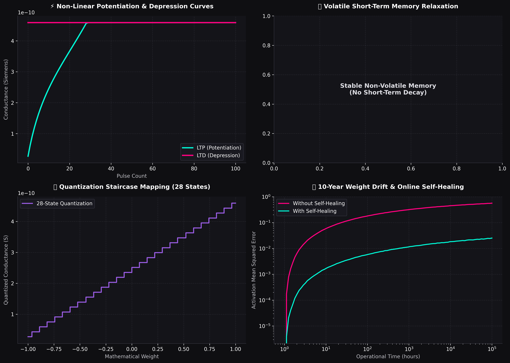

# 💎 Bionic Device Physical Datasheet: FingerMemristor
**Device Type**: `NONVOLATILE` | **Memory Category**: `Non-Volatile`
**Fitted Date**: 2026-06-15

## 📊 1. Core Physical Parameters

| Parameter | Physical Value | Description |
| :--- | :--- | :--- |
| **Conductance Min ($G_{min}$)** | 2.7100e-11 S | Minimum physical state conductance |
| **Conductance Max ($G_{max}$)** | 4.5900e-10 S | Maximum physical state conductance |
| **Device Noise Ratio** | 2.00% | Cumulative D2D/C2C process variance |
| **Discrete States Count** | 28 | Number of hardware conductance levels |
| **Volatility Decay ($\tau$)** | Infinite | Dynamic relaxation time constant |

## 🛠️ 2. Non-Linearity Coefficients (LTP/LTD Slope Polynomials)
$$\Delta G_{LTP} = -0.0168 \cdot G^3 + 0.1139 \cdot G^2 + -0.1494 \cdot G + 0.0807$$
$$\Delta G_{LTD} = 0.3689 \cdot G^3 + -0.4033 \cdot G^2 + -0.0319 \cdot G + -0.0060$$

## 📈 3. Physical Diagnostic Visualization

---
**Report Generated By**: Organic CIM Simulation & Neuromorphic Computing Platform CLI