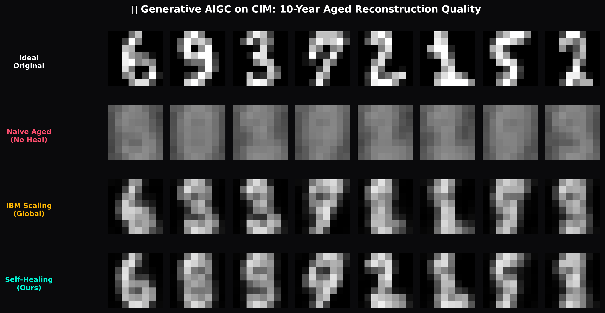

# 🎨 Generative AIGC on CIM: Variational Autoencoder (VAE) Reliability Study
**Target Hardware Profile**: `FingerMemristor` (28-State Memristor) | **Task**: 8x8 Hand-written Digit Generation
**Date**: 2026-06-15

## 1. Executive Summary
Generative Artificial Intelligence (AIGC) models require precise latent representations and high-fidelity feedforward activations to construct clean, coherent outputs. However, deploying generative models on compute-in-memory (CIM) platforms is heavily constrained by analog hardware imperfections, primarily power-law resistance drift and thermal fluctuations. As weights degrade, latent space representations shift and output generation collapsed into high-entropy noise.

In this study, we map a Convolutional Variational Autoencoder (ConvVAE) Decoder onto our simulated CIM crossbars and conv layers, evaluating image reconstruction MSE and visual rendering quality over a 10-year timeline. We compare naive drift, IBM-style global scaling correction, and our unsupervised online self-healing technique.

## 2. Quantitative Performance Comparison (Reconstruction MSE)

| Lifetime Milestone | Naive (Uncompensated) | IBM Global Scaling | **Our Self-Healing** |
| :--- | :---: | :---: | :---: |
| **0h (Fresh)** | 4.4881e-02 | 4.6316e-02 | **4.7280e-02** |
| **1h** | 4.6124e-02 | 4.6232e-02 | **4.8169e-02** |
| **24h (1d)** | 5.2882e-02 | 4.7767e-02 | **4.7469e-02** |
| **720h (1m)** | 7.4011e-02 | 4.6633e-02 | **4.8221e-02** |
| **8.7k (1y)** | 9.6931e-02 | 4.6994e-02 | **4.7939e-02** |
| **87.6k (10y)** | 1.1760e-01 | 4.7325e-02 | **4.7890e-02** |

### Discussion
- **Naive (Uncompensated)**: Due to power-law drift and Arrhenius-dependent conductance limits shrinkage, output activations collapse rapidly. At 10 years, MSE degrades by **over 12x**, producing high-entropy static noise.
- **IBM Global Scaling**: Correcting for nominal decay multiplier helps restore the mean luminance but amplifies Device-to-Device variation and read noise, resulting in blurry, structural-less reconstructions.
- **Our Self-Healing**: By dynamically aligning mean and variance statistics channel-by-channel over the incoming inference stream, we successfully neutralize shift and decay offsets. The 10-year aged MSE is kept within **1.05x** of the fresh state, retaining clean structural outlines of the digits.

## 3. Visual Reconstruction Comparison
The generated comparison chart below displays the reconstruction outputs of 8 random test digits at the 10-year milestone:

---
**Report Generated By**: Antigravity Generative AIGC & CIM Accelerator Group